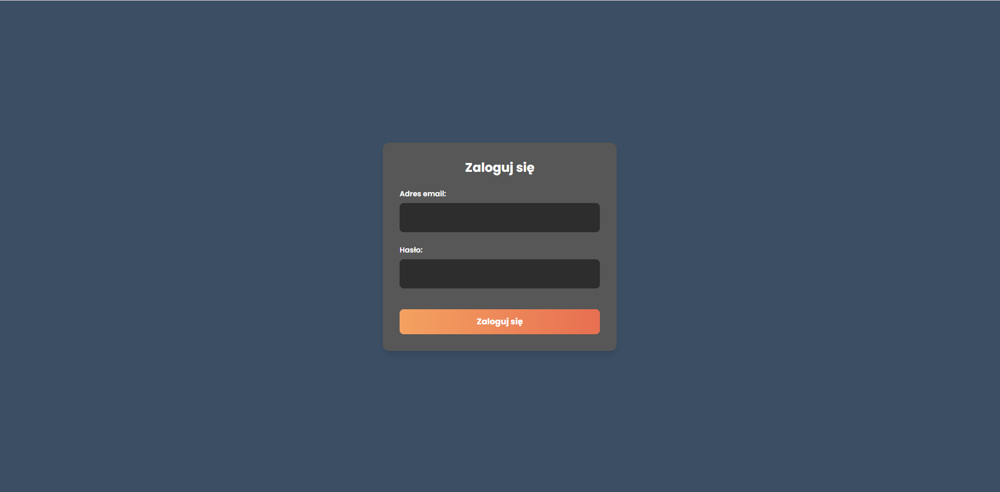
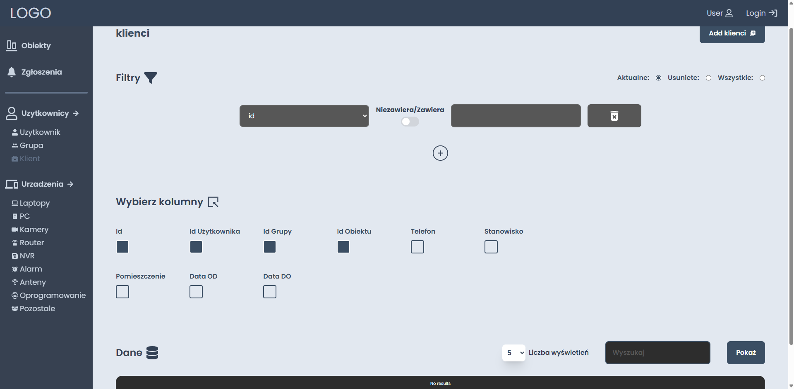
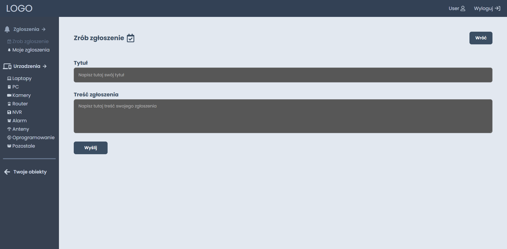
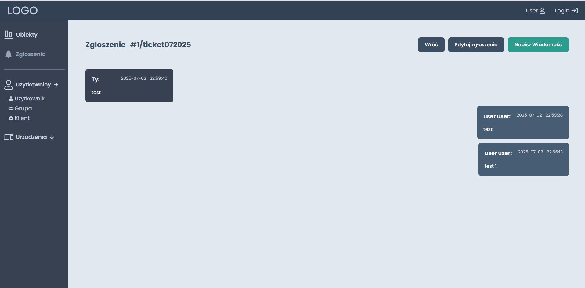

## ✍️ Description
This project was created during my internship at a company, based on specific requirements provided by the employer. While some features remain unfinished due to time constraints, the application is designed to support effective collaboration with clients. Its main goal is to facilitate communication and streamline administrative processes.

⚠️ PS: Some parts of the application may be unclear, as it was developed with a very specific use case in mind — intended to be operated by a single administrative user, or at most two

## 🛠️ More About Project
The project is divided into two parts: the administrator panel and the user interface.
This structure was implemented in accordance with the project requirements provided by company.

To properly test the system, both interfaces should be open, and actions should be performed on both sides.

**Test account for user login:**

Email: `test@gmail.com`

Password: `test`

## ⌨️ Technologies
- **React**
- **Node.js**
- **MySQL**

## ⚙️ Installation

### Database Setup

1. Download the database file: [workhelper.sql](workhelper.sql)
2. Open **phpMyAdmin** or any MySQL client.
3. Create a new database named `workhelper`.
4. Import the downloaded file into the `workhelper` database.

5. Clone both repositories and follow the instructions provided in each one accordingly.

## 🖼️ Illustrative photos

